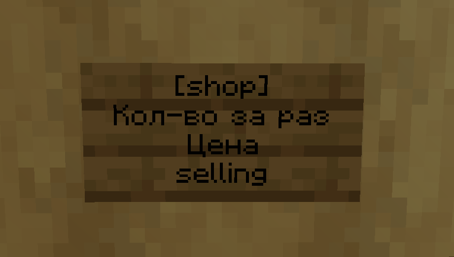

# ChestShop

### Описание:

Создайте свой собственный магазин с помощью сундука и таблички

### Создание магазина

* Поставьте сундук и установите на него табличку написав следующее:

* После этого ударьте предметом который хотите продавать по табличке

_`selling` обозначает что магазин продает вещи, если вы хотите скупать напишите `buying`_
